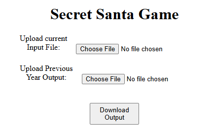

# Secret Santa Game

1. **Description**

The program gets input as CSV or XLSX from user and  processes two input files (current year input data and previous year output data) then assigns the secret child based on the condition:

- An employee cannot choose themselves as their secret child. 
- An employee cannot be assigned to the same secret child as in the previous year's Secret Santa event, if applicable. 
- Each employee must have exactly one secret child. 
- Each secret child should be assigned to only one employee. 

2. **Application**



- Upload both input files (current input list and previous year input)
- Click Download Output, A CSV file will be downloaded

## Getting Started

1. **Clone the Repository**

   ```bash
   git clone https://github.com/saravana-ganesh12/secret-santa.git
    ```
    ```bash
    cd secret-santa
    ```

2. **Install Dependencies**

    Run the below command to install all required dependencies:

    ```bash
    npm install
    ```

3. **To start the server:**

    Run the below command to start the program on http://localhost:5000

    ```bash
    node server.js
    ```

## Run Test Case

1. **To Run the test:**

    Run the below command to test the program

    ```bash
    node test
    ```


## Directory Structure


    secret-santa/
    ├── utils/                  - Directory for utility classes
    │   ├── Randomize.js        - Shuffle logic for randomizing input data
    │   ├── Validate.js         - Validation logic for having no repetition with previous year
    │   └── JsonToCsv.js        - Convert Array of objects to Comma seperated values (CSV)
    │   └── AssignChild.js      - Main logic
    ├── public/     
    |   ├── index.html          - HTML page for uploading files
    |   |── image.png           - Screenshot of the application
    ├── test/   
    |   ├── testCase.test.js    - Test case for validate class
    ├── server.js               - Express server with file handling logic
    ├── .gitignore              - Files and folders that are ignored by git 
    |── package.json            - npm dependencies and scripts
    └── package-lock.json       - Exact dependencies versions
